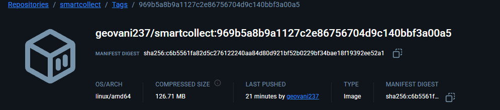

# Projeto - Smartcollect

##  Como executar localmente com Docker
```bash
  docker-compose up -d
```

##  Pipeline CI/CD

Toda vez que ocorre um **push** nas branches `main` ou `staging`, o GitHub Actions é acionado para executar testes automatizados e, se tudo estiver correto, faz o deploy automático para os ambientes de produção ou staging, respectivamente.
Fluxo do pipeline:
1. **Build**: O código é construído e as dependências são instaladas.
2. **Deploy**: Se os testes passarem, o código é implantado no ambiente correspondente (produção ou staging).

##  Containerização

Foi adotado a arquitetura de multi-stage builds para otimizar o tamanho da imagem Docker. A imagem final contém apenas o necessário para a execução da aplicação, reduzindo o consumo de recursos e melhorando a segurança.
Também implementamos a estratégia de cache de dependências do Mavem, Empacotamento do JAR, tudo isso com uma Imagem de runtime leve
##  Prints do funcionamento



##  Tecnologias utilizadas

- Java 24
- Spring Boot
- Maven
- Docker
- GitHub Actions
